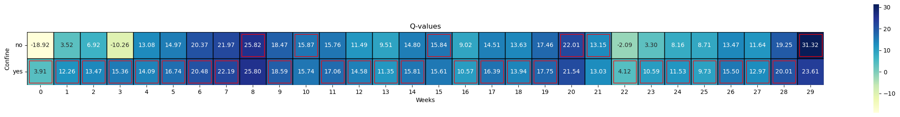
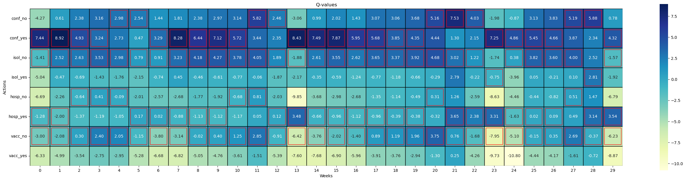
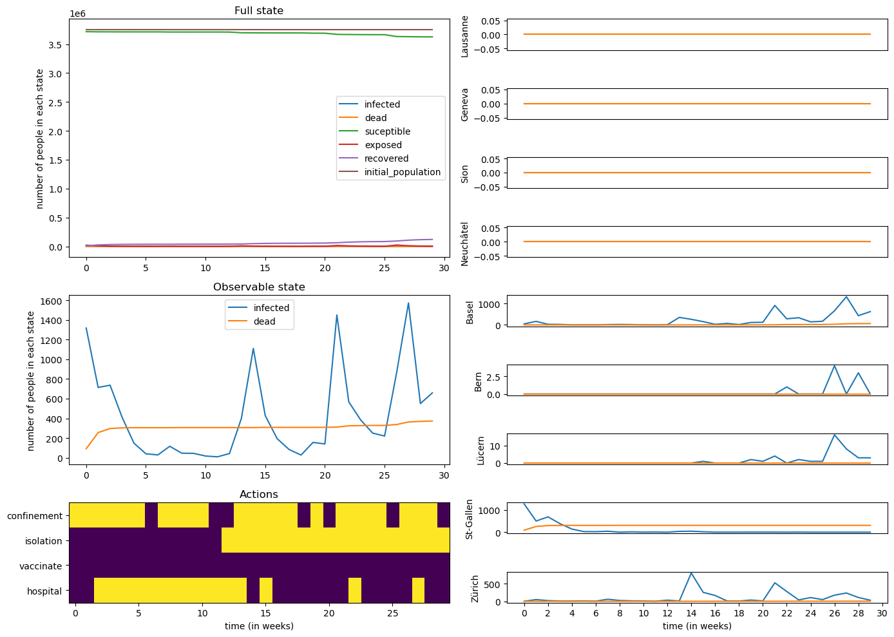
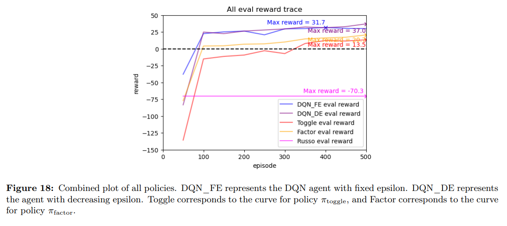
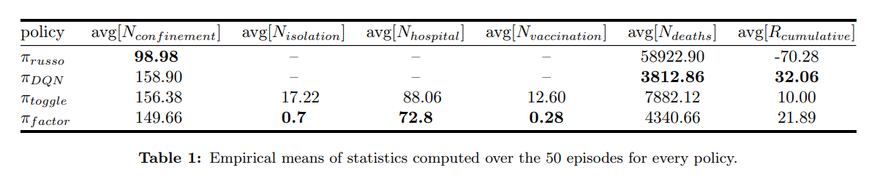

# DQN for epidemic mitigation
This is the project repo for Deep Q-learning for epidemic control, refer to EPFL CS456 - Artificial Neural Network and Reinforcement learning.   
### Group Member:  
Du Junye (junyedu2-c@my.cityu.edu.hk)  
Zou Mengjie (mengjie.zou@epfl.ch)

## DQN & Factorized Q-learning approach heatmap

## Agent Simulation

## Result comparison

Welcome to contact us if you have any questions!